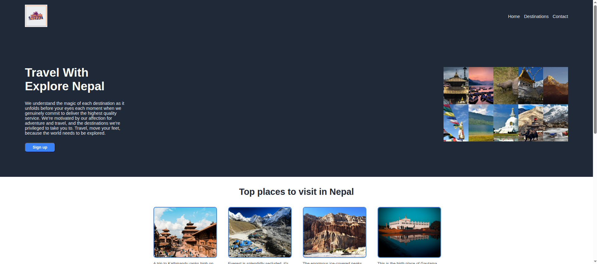
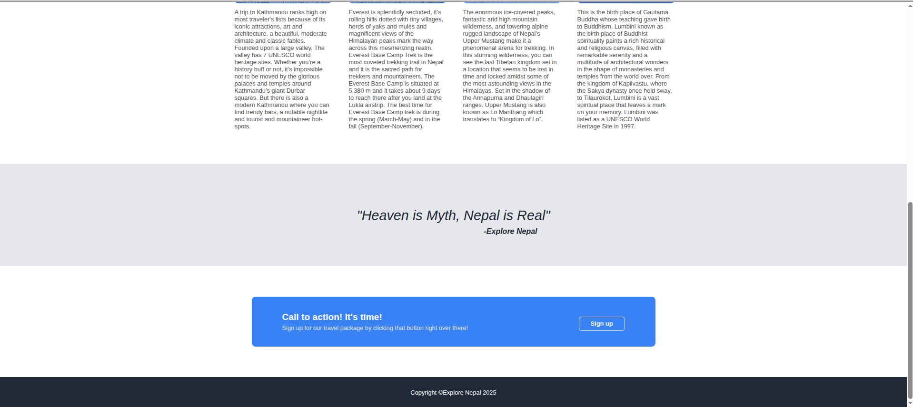

# Explore Nepal - Landing Page

This is a landing page project built as part of **The Odin Project - Foundations Course**.
The goal of this project was to practice **HTML**, **CSS**, **Flexbox**, and basic layout design by recreating a modern style landing page.

## 🚀 Features

- Responsive layout using **Flexbox**
- Clean and modern travel-themed design
- Hero section with main heading and featured image
- Popular destinations section with images and descriptions
- Quote block
- Call-to-action section with signup button
- Custom hover effects on images, buttons, links, and logo

---

## 🛠 Technologies Used
- HTML5 
- CSS3
- Flexbox

---

## How to run the project
- Clone the repository
- Open 'index.html' in any browser

---

## 📸 Screenshots
### Explore Nepal-Landing Page

---

## 💡 What I Learned

- Structuring a complete webpage
- Using **Flexbox** for layout and alignment
- Creating reusable CSS classes
- Managing images and content sections
- Adding hover effects for better UI experience
- Writing clean and readable code
- Improving HTML/CSS design thinking

---

##Future Improvements
- Add JS for intreactive features
- My styles like CSS Grid

---

## Aknowledgements
-Images
1. College of Attractions from Himalayan Dreams (https://www.himalayan-dreams.com/)
2. Kathmandu Valley from Pexels by Mehmet Turget Kikgoz
3. Everest Base Camp from Unsplash by Dylan Shaw
4. Upper Mustang from Pexels by Sagar Gnawali
5. Lumbini from Pexabay by Jessica Bleu Elephants

-Icons
1. From Explore Nepal (Viber)